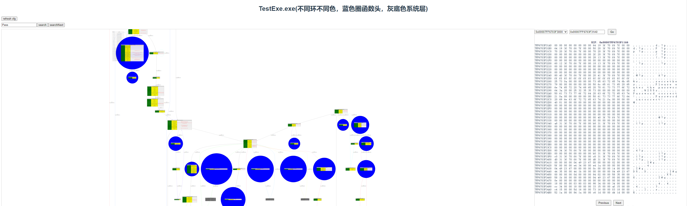

## exe analyzer
一款64位Exe程序动态追踪执行流程以及保存信息的工具

### 安装
程序分为三部分

1. exe-analyzer: 调试跟踪工具
2. exe-analyzer-be: 流程图生成以及模拟执行，作为后端
3. exe-analyzer-fe: 前端展示流程图，以及调试信息

#### exe-analyzer
无安装过程使用即可，这里附带了vcruntime的环境，防止部分机器没有vc环境

#### exe-analyzer-be
这里使用conda生成的python 3.12.7，具体安装过程在exe-analyzer-be中有命令介绍

#### exe-analyzer-fe
使用的nodejs v18.20.4，具体安装过程在exe-analyzer-fe中有命令介绍

### exe-analyzer使用
```bash
trace exe and analyzer cfg.
Usage:
  exe-analyzer.exe [OPTION...]

  -a, --app arg        Application path (default: "")
  -p, --params arg     Application params (default: "")
  -s, --start arg      Start offset, 0 is start from entry point. (default:
                       0)
  -e, --end arg        End offset, 0 is stop until process exit. (default:
                       0)
  -w, --workspace arg  Workspace name (default: "")
  -h, --help           Print help
```

1. `--app`      参数： 指定需要跟踪的exe程序
2. `--params`   参数： exe程序执行的参数字符串
3. `--workspace`参数： 保存的工作空间路径，如果没有将会递归创建
4. `--start`    参数： 追踪的起始偏移地址，0则代表从EOP开始追踪
5. `--end`      参数： 追踪的结束偏移地址，0则代表直到程序退出

程序将会在工作空间存储相关追踪信息，此工作空间需要传递给exe-analyzer-be使用。

程序暂时没有提供python外接，断点支持内存断点，硬件断点，软件断点，但目前需求暂无，之后版本将会更新。

### exe-analyzer-be使用
```bash
usage: run.py [-h] [-w WORKSPACE]

exe any be.

options:
  -h, --help            show this help message and exit
  -w WORKSPACE, --workspace WORKSPACE
                        work space
```

1. `-w`参数： 指定exe-analyzer创建的工作空间

程序将会在static文件夹下创建svg流程图供exe-analyzer-fe使用，并开启5000端口。

### exe-analyzer-fe使用
```bash
npm run dev
```
启动即可，程序将会监听8080端口。

访问8080端口，即可进行查看以及操作流程图。

双击指令地址，即可查看此条指令处的相关寄存器信息以及内存状态。

灰色填充中的块代表的是系统层的调用，蓝色圈中代表当前程序空间函数，不同的环使用不同颜色标注，为了对抗自定义堆栈类型的操作，所以这里会将一部分的系统层代码进行步入。

